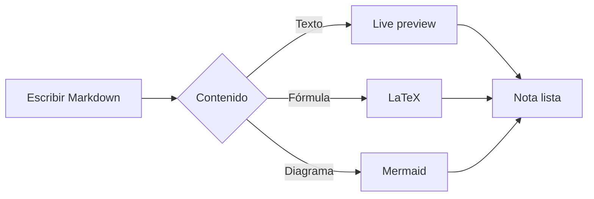
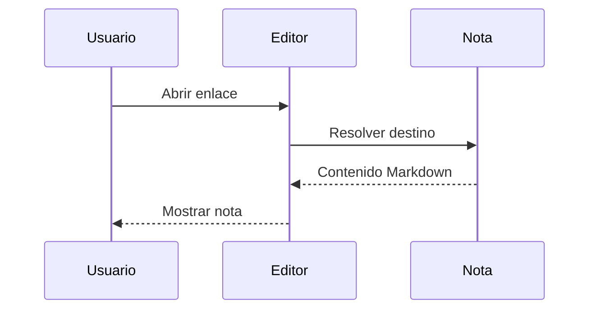

# Markdown live preview

Write Markdown in **Source** mode or edit the formatted document in **Live preview**, just like NeverWrite. Turn on the preview pane to read both views together.

## Edit in place

Click **bold text**, *emphasis*, ~~strikethrough~~, `inline code`, or ==highlighted text== to reveal its Markdown syntax. Moving the caret away hides the markers again.

Selections reveal the source they touch. Copy, paste, search, and undo all use the original Markdown.

## Lists and tasks

- One document shared by every mode
- Unicode works too: niño, 世界, café
- Nested formatting: **_bold and italic_**

- [x] Open the Markdown editor
- [ ] Click a task checkbox
- [ ] Try switching modes after an edit

## Code

```rust
let editor = cx.new(|cx| {
    EditorState::new(window, cx)
        .language("markdown")
        .default_value("# Hello\n\n**Markdown**")
});

Editor::new(&editor).markdown_mode(MarkdownMode::LivePreview)
```

## Enlaces entre notas

Visita [[Viaje]], [[Ideas.md|ideas para el viaje]] o [[No existe|una nota pendiente]].
En Live preview, usa Ctrl+clic (Cmd+clic en macOS) para navegar; en el panel Preview basta un clic.
Las pestañas de notas permiten volver a esta demostración. Cada nota conserva sus ediciones y su historial.

![[Viaje]]

![[Vacia]]

![[No existe]]

Haz clic en el título de una tarjeta para abrir su nota, o en el contenido para editar el embed.
Los tokens escapados, como \[[Ideas]], y el código `![[Viaje]]` permanecen literales.

## Fórmulas LaTeX

Las fórmulas se pueden mezclar con texto: $e^{i\pi} + 1 = 0$ y $\frac{a}{b}$.
Usa `$$` para una fórmula centrada en su propio bloque:

$$
\int_0^\infty e^{-x^2}\,dx = \frac{\sqrt{\pi}}{2}
$$

```latex
\begin{pmatrix}
1 & 2 \\
3 & 4
\end{pmatrix}
\begin{pmatrix}x\\y\end{pmatrix}
= \begin{pmatrix}x+2y\\3x+4y\end{pmatrix}
```

También funcionan dentro de una cita y una tabla:

> La identidad de Pitágoras es $a^2 + b^2 = c^2$.

| Nombre | Fórmula |
| :--- | :--- |
| Área del círculo | $A = \pi r^2$ |
| Suma | $\sum_{k=1}^{n} k = \frac{n(n+1)}{2}$ |

## Diagramas Mermaid





Haz clic en una fórmula o un diagrama para editar su fuente, y mueve el cursor fuera
del bloque para volver a renderizarlo. La acción de copiar conserva la sintaxis Markdown.
El código `\frac{a}{b}` y los dólares escapados \$20 permanecen como texto.

## Images

Images are centered and keep their proportions. Click the image to edit its source,
then move the caret outside its paragraph to show the image again.

![[/assets/paisaje-lago.png|400]]

Change `400` to `200`, or remove `|400` to use the image's natural size.
Relative paths work too: `![[assets/paisaje-lago.png|200]]`.

## Tables

| Mode | What you see | Editable |
| :--- | :--- | :---: |
| Source | Original Markdown | Yes |
| Live preview | Formatting with syntax on demand | Yes |
| Preview pane | Rendered document | Select and copy |

> Click a rendered heading, quote, code block, or table to edit its source. Move the caret outside the block to render it again.

Read more at [GPUI Component](https://longbridge.github.io/gpui-component/).

---

The Markdown source remains the saved document in every mode.
