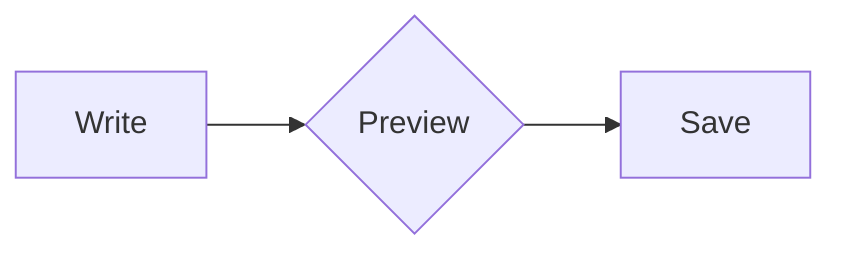

# Editor

`Editor` is the styled source-code control. Use [`Input`](./input.md) for
single-line values and [`Textarea`](./textarea.md) for ordinary multi-line text.

## Import

```rust
use gpui_component::input::{Editor, EditorState, TabSize};
```

## Basic usage

```rust
let editor = cx.new(|cx| {
    EditorState::new(window, cx)
        .language("rust")
        .line_number(true)
        .folding(true)
        .tab_size(TabSize {
            tab_size: 4,
            hard_tabs: false,
        })
        .default_value("fn main() {\n    println!(\"Hello\");\n}")
});

Editor::new(&editor).h(px(320.))
```

The language set via `.language()` selects syntax highlighting. Enable the
matching Cargo feature, such as `tree-sitter-rust` or `tree-sitter-markdown`;
use `tree-sitter-languages` to bundle all built-in grammars.

## Editor options

```rust
let editor = cx.new(|cx| {
    EditorState::new(window, cx)
        .language("json")
        .line_number(true)
        .folding(true)
        .show_whitespaces(true)
        .default_value(source)
});
```

## Markdown modes

Use the same `EditorState` to switch between Markdown source and an editable
live preview. A live preview hides syntax outside the active token, renders
headings, code blocks, tables, images, quotes and task lists, and reveals a
block's source when clicked or selected.

```rust
use gpui_component::input::{Editor, EditorState, MarkdownMode};

let editor = cx.new(|cx| {
    EditorState::new(window, cx)
        .language("markdown")
        .line_number(false)
        .folding(false)
        .default_value("# Notes\n\n**Hello**\n\n- [ ] Write a note")
});

Editor::new(&editor)
    .markdown_mode(MarkdownMode::LivePreview)
    .h(px(480.))
```

`MarkdownMode::Source` shows the editable source; `MarkdownMode::Preview`
provides a selectable reading view. Put a second editor with `Preview` next
to the editable one to make a live preview pane. Both read the same state.
The pane refreshes automatically when the document changes.

Formatting supports bold, italic, strikethrough, inline code, links and
`==highlight==`. Ctrl-click (Cmd-click on macOS) opens inline links. Task
checkboxes, including nested tasks and tasks inside quotes, update the original
`[ ]` / `[x]` marker and participate in undo.
Read-only mode disables task changes while keeping source selection available.

Tables in both preview modes use Comet's frameless appearance and bundled Geist
font faces (including bold and italic): a bold header,
thin horizontal separators and 12px cell padding. Columns share the available
width in proportion to their formatted content and scroll horizontally when
their minimum widths no longer fit.

Image embeds support NeverWrite/Obsidian syntax: `![[/assets/photo.png|400]]`
sets a 400px width, while `![[/assets/photo.png]]` uses the natural size.
Images in their own paragraphs are centered, with 8px vertical padding,
6px rounded corners and a maximum height of 500px, matching NeverWrite.
The image keeps its proportions and fits the available width. Both preview
modes render these embeds; source editing, copy and undo keep the original syntax.
Escaped embeds and embeds inside code remain literal text.

Configure the image root explicitly for local files:

```rust
Editor::new(&state)
    .markdown_mode(MarkdownMode::LivePreview)
    .markdown_image_root("/path/to/vault")
```

Paths beginning with `/` are relative to this root, as in NeverWrite. Relative
paths also resolve from the root. Local images cannot escape it through `..`
or symlinks. Ordinary Markdown images use the same root. Without a root, images
remain URI-backed. This does not import or save pasted/dropped image files.

During mouse selection, the live preview keeps its current formatting and
layout. The selected Markdown source is revealed when the left button is
released, including when released outside the editor.

### Incremental Markdown analysis

Live preview records byte edits, including undo/redo and IME replacements, and
coalesces edits before the next display update. Both preview modes reparse the
affected root blocks with neighboring blocks as boundary guards. The guards
must retain the exact AST and relative positions. Unchanged blocks keep their
render data; rendered blocks in Live preview also keep a stable identity when
their source position moves.

Analysis falls back to the whole document when boundaries do not stabilize,
when the document contains link definitions or footnotes, or when the proposed
window exceeds 64 KiB. A long paragraph or list is one root block. TextView also
uses full analysis for MDX and application block parsers whose payloads may
contain source positions. The editor's built-in code renderer supports reuse.

This reduces parsing work for local edits. Relocating suffix ranges and
rebuilding the editor projection
still depend on document size. Reading Preview also copies the changed source
and locates the difference between complete strings. Its background worker
receives the synchronous parsed result without analyzing it a second time.

### Links and embeds between notes

Both preview modes support `[[note]]`, `[[note|Label]]`, and `![[note]]`.
Image extensions in `![[...]]` keep the image behavior described above.
Notes render in a framed card with a clickable title and Markdown content;
long content scrolls inside the card. Missing and empty notes have visible
states, and recursive embeds stop at repeated canonical ids or four levels.
Escaped tokens and tokens in code stay literal. Alias separators also accept
the GFM table spelling `\|`.

The component asks the application to resolve each target and navigate:

```rust
use gpui_component::text::{MarkdownNote, MarkdownNotes};

let notes = MarkdownNotes::new(
    |target| {
        (target == "Welcome").then(|| MarkdownNote {
            id: "welcome.md".into(),
            title: "Welcome".into(),
            markdown: "# Welcome\n\nA linked note.".into(),
        })
    },
    |note, window, cx| {
        // Open note.id in the application's note editor.
    },
);

Editor::new(&state)
    .markdown_mode(MarkdownMode::LivePreview)
    .markdown_notes(notes.clone())
```

Use an in-memory index/cache for resolution. The application decides how names,
paths, extensions and aliases map to canonical ids, loads Markdown, and opens
notes. Navigation callbacks run after the input event releases its editor borrow.
No disk writes or note creation happen inside the component. Keep the
`MarkdownNotes` value between renders; assign `notes = notes.refreshed()` and
notify the owning view after changing the index or another note's contents.
Markdown views of the same editor state inherit the configured callbacks.

In Live preview, Ctrl-click (Cmd-click on macOS) follows an inline link or a
link inside a rendered block. In Preview, use a regular click. Clicking an embed
title opens its note; clicking its body in Live preview reveals the embed source.
The Editor story includes editable Demo, Viaje, Ideas and empty notes, with
independent editor states to preserve edits and undo history during navigation.

### Mermaid and LaTeX

Live preview and Preview render fenced `mermaid` diagrams, inline math with
`$...$`, and display math with `$$` on their own lines. Fences named `math`,
`latex` or `tex` also render a math expression in display style:

````markdown
The identity $e^{i\pi} + 1 = 0$ appears inside its paragraph.

$$
\int_0^\infty e^{-x^2}\,dx = \frac{\sqrt{\pi}}{2}
$$


````

Rendering uses the native [mermaid-rs-renderer](https://github.com/1jehuang/mermaid-rs-renderer)
and [RaTeX](https://github.com/erweixin/RaTeX) engines. KaTeX fonts are embedded;
the application needs no browser, Node.js, TeX installation or rendering service.
Diagrams and display formulas are centered and shrink proportionally to fit the
available width. Formula colors and diagram themes follow light/dark mode.
Renderer results are cached, and the geometry is reserved before image decoding
to keep the layout stable.

LaTeX support covers math expressions, including fractions, roots, integrals,
sums and matrices; full TeX documents are not a supported input format.
Mermaid syntax support follows the native engine and can differ from Mermaid.js.
Invalid blocks show an error and their source; invalid inline formulas remain
visible as their original source in the error color. A rendering input is limited
to 32 KiB. Escaped dollars (`\$`) and formulas inside ordinary code remain literal.

Click a diagram or a display formula in Live preview to reveal its source.
Paragraphs containing inline formulas reveal their whole paragraph while it is
being edited, then render again after moving the caret away. Lists with inline
math render as list items, preserving task checkboxes. The copy action copies
the original Markdown; source copying also preserves inline math delimiters.
The same rendering works inside headings, quotes, tables and embedded notes.

Clicking the upper half of a rendered block reveals its source at the start;
clicking the lower half places the cursor at the end.

In both editable modes, Enter continues bullets, ordered lists, task lists and
quote prefixes. New tasks start unchecked, and Enter on an empty item removes
its marker. Enter on an empty quote removes one quote level. Shift+Enter inserts
a newline without continuing a marker. Fenced code keeps normal editor behavior.

Switching modes does not replace the source, cursor, selection or undo history.
Parsing and preview rendering work without tree-sitter, including on WASM;
the Markdown grammar feature only adds source syntax highlighting.

## Decorations

```rust
let decorations = editor.update(cx, |state, cx| {
    state.create_decorations_collection(initial_decorations, cx)
});
```

Keep the returned `TextDecorationCollection` alive while the decorations are
needed. Its ranges follow subsequent text edits.

## Value and events

```rust
let source = editor.read(cx).value();

editor.update(cx, |state, cx| {
    state.set_value(new_source, window, cx);
});

cx.subscribe(&editor, |this, state, event: &InputEvent, cx| {
    if matches!(event, InputEvent::Change) {
        this.source = state.read(cx).value();
        cx.notify();
    }
});
```

## Appearance

```rust
Editor::new(&editor)
    .h(px(480.))
    .bordered(true)
    .disabled(false)
    .readonly(false)
    .aria_label("Rust source")
```

Use `readonly` to preview a file without allowing changes. Unlike `disabled`,
a read-only editor keeps the normal appearance and still can be focused,
selected, copied and searched, it only rejects the changes made by the user.
The programmatic APIs such as `set_value` keep working.

```rust
Editor::new(&editor).readonly(true)
```

Editor focus does not add the single-line Input focus-border treatment. The
gutter, current-line background, and scrollbars are painted as one aligned
editor surface.

Input-only adornments such as `prefix`, `suffix`, mask toggle, and clear button
are intentionally absent. Compose toolbars and actions around `Editor`.
