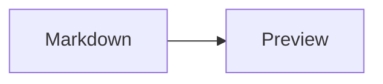

# TextView

`TextView` renders formatted text in GPUI. It supports Markdown and simple HTML, text selection, code block actions, and custom Markdown plugins for project-specific syntax.

`TextView::selectable(true)` uses the shared window selection engine from `gpui-base`. See [GPUI Base Text Selection](/base/text-selection.md) when integrating plain text or a custom renderer with the same selection.

## Import

```rust
use gpui_component::text::{markdown, TextView};
```

## Usage

### Markdown

Use the `markdown` helper when you only need to render Markdown text:

```rust
use gpui_component::text::markdown;

markdown("# Hello\n\nThis is **Markdown**.")
    .selectable(true)
    .scrollable(true)
```

You can also construct a `TextView` directly when you need a stable id:

```rust
use gpui_component::text::TextView;

TextView::markdown("preview", markdown_source)
    .selectable(true)
```

### HTML

```rust
TextView::html("html-preview", "<strong>Hello</strong>")
```

### Wiki note links and embeds

Configure the same application-owned `MarkdownNotes` callbacks used by Editor:

```rust
use gpui_component::text::{TextView, TextViewStyle};

TextView::markdown("note", "See [[Welcome|the introduction]].\n\n![[Welcome]]")
    .style(TextViewStyle::default().notes(notes.clone()))
```

`[[note]]` links navigate on click; `![[note]]` renders a card with a clickable
title and Markdown content. Missing notes are marked, empty notes have a
placeholder, and recursive embeds stop at repeated canonical ids or four levels.
Image embeds such as `![[/assets/photo.png|400]]` retain their image behavior.
Escaped tokens and code stay literal. Source copying preserves wiki syntax.
Keep callbacks stable between renders and use `notes.refreshed()` after external
note changes. The resolver should use an in-memory index, with canonical ids
shared by every alias of a note; loading and persistence belong to the host.
See [Editor](./editor.md#links-and-embeds-between-notes) for a callback example.
Wiki links use the note navigator; `on_link_click` continues to handle ordinary
Markdown and HTML links.

### Mermaid and LaTeX math

Markdown TextViews render `mermaid` fences, inline `$...$` math, and display
`$$...$$` math automatically. `math`, `latex` and `tex` fences accept a math
expression in display style. The native engines work offline, with bundled
KaTeX fonts. Math also works inside formatted text, headings, lists, quotes,
table cells and note embeds.

````rust
TextView::markdown("advanced", r#"
Inline: $\frac{a}{b}$.

$$
\sqrt{x^2 + y^2}
$$


"#)
````

Diagrams and display math fit the available width and follow the current theme.
Source copying and block copy actions keep the original Markdown spelling.
Errors retain visible source so the input can be corrected. Inputs are limited
to 32 KiB per formula/diagram. Use `\$` for literal dollar signs, and ordinary
code fences or inline code when showing formula syntax as text. See
[Editor](./editor.md#mermaid-and-latex) for supported engines and editing behavior.

## Link Click Handling

Use `on_link_click` when links should be routed by the application instead of
being opened directly by `App::open_url`. The callback receives the resolved
URL and the original GPUI `ClickEvent`, so it can distinguish mouse buttons,
keyboard activation, touch, and modifier keys:

```rust
use gpui::ClickEvent;
use gpui_component::text::markdown;

markdown("[Open the project](https://github.com/longbridge/gpui-component)")
    .on_link_click(|url, event, _window, cx| {
        if event.is_right_click() {
            println!("Show a context menu for {url}");
            return;
        }

        match event {
            ClickEvent::Mouse(click) if click.up.modifiers.control => {
                println!("Open {url} in an internal view");
            }
            _ => cx.open_url(url),
        }
    })
```

Installing a handler consumes the link event and disables the default URL
opening behavior. If no handler is installed, links continue to use
`App::open_url` as usual. The callback is used for both text links and linked
images.

## Incremental Updates

Markdown `set_text` and streamed appends reuse unchanged root blocks. A local
parse includes neighboring blocks and validates their ASTs and relative source
positions before keeping the rest of the document. Retained formulas, diagrams
and code blocks keep their parsed/render data. Source spans of later blocks are
relocated to preserve selection copying and task callback offsets.

Link definitions, footnotes, unstable boundaries, windows larger than 64 KiB,
MDX and application block parsers use full parsing. Custom parser payloads may
depend on the complete source or contain absolute offsets that TextView cannot
relocate. Comparing complete input strings and moving spans remain linear;
this optimization bounds the syntax analysis for ordinary local updates.

## Task Checkbox Handling

Use `on_task_toggle` to make Markdown task checkboxes interactive, including
nested tasks and tasks inside quotes:

```rust
markdown(source)
    .on_task_toggle(|item_offset, checked, window, cx| {
        // Apply the change to the document that owns this preview.
    })
    .task_list_readonly(false)
```

The callback receives the task list item's UTF-8 byte offset in the supplied
source and its new checked state. The owner updates the corresponding `[ ]` /
`[x]` marker and renders the changed source. `task_list_readonly(true)` disables
the controls. Without a callback, task checkboxes remain a static representation.

## Table Appearance

Use `TableAppearance::Plain` for frameless tables in bundled Geist, with a bold header, thin
horizontal separators and 12px cell padding. Columns use measured content
widths to distribute space and scroll horizontally when their minimum widths
no longer fit.

```rust
use gpui_component::text::{TableAppearance, TextView, TextViewStyle};

TextView::markdown("table", "| Name | Value |\n| --- | --- |\n| Example | 42 |")
    .style(TextViewStyle::default().table_appearance(TableAppearance::Plain))
```

## Image Embeds

Markdown views support `![[image.png]]` and `![[image.png|400]]` alongside
ordinary `` images. The optional positive integer is a width in pixels.
Rendered-to-Markdown copy preserves the embed syntax.
Images in their own paragraphs are centered, with 8px vertical padding,
6px rounded corners and a maximum height of 500px.

For local images, use an explicit image root:

```rust
TextView::markdown("images", "![[/assets/photo.png|400]]")
    .style(TextViewStyle::default().image_root("/path/to/vault"))
```

Leading `/` and relative image paths resolve inside this root. Files outside
the root are not loaded. HTTP(S) images continue to use the URI loader.

## Markdown Plugins

Use `.plugin(...)` to support custom Markdown formats. A plugin owns both parsing and rendering, so callers only need to attach it to the `TextView`:

```rust
markdown(source)
    .plugin(TickerPlugin::new())
```

A Markdown plugin implements `MarkdownPlugin`:

```rust
use gpui::{App, IntoElement, ParentElement as _, Window};
use gpui_component::text::{
    markdown_ast, MarkdownNode, MarkdownParseContext, MarkdownPlugin,
};

struct TickerNode {
    symbol: String,
}

struct TickerPlugin;

impl TickerPlugin {
    fn new() -> Self {
        Self
    }
}

impl MarkdownPlugin for TickerPlugin {
    fn is_block(&self) -> bool {
        true
    }

    fn name(&self) -> &str {
        "ticker"
    }

    fn parse(
        &self,
        node: &markdown_ast::Node,
        cx: &MarkdownParseContext<'_>,
    ) -> Option<MarkdownNode> {
        let markdown_ast::Node::Paragraph(paragraph) = node else {
            return None;
        };
        let [markdown_ast::Node::Text(text)] = paragraph.children.as_slice() else {
            return None;
        };
        let symbol = text.value.strip_prefix('$')?;

        Some(
            MarkdownNode::new(
                "ticker",
                TickerNode {
                    symbol: symbol.to_string(),
                },
            )
            .text(format!("${symbol}"))
            .markdown(cx.node_source(node).unwrap_or(text.value.as_str())),
        )
    }

    fn render(
        &self,
        node: &MarkdownNode,
        _window: &mut Window,
        _cx: &mut App,
    ) -> impl IntoElement {
        let ticker = node.data::<TickerNode>().expect("ticker node data");

        gpui::div().child(format!("${}", ticker.symbol))
    }
}
```

Then attach it to a Markdown `TextView`:

```rust
markdown("$AAPL.US")
    .plugin(TickerPlugin::new())
```

## MarkdownNode

`MarkdownNode` is the neutral data passed between `parse` and `render`.

```rust
MarkdownNode::new("ticker", TickerNode { symbol })
    .text("$AAPL.US")
    .markdown("$AAPL.US")
```

- `name` is the stable node name used to match the renderer.
- `data` is typed parser output read with `node.data::<T>()`.
- `text` is the plain text representation used by selection and fallback rendering.
- `markdown` is the Markdown representation used when the document is serialized back to Markdown.

## Block Plugins

Custom Markdown rendering currently supports block plugins. Return `true` from `is_block()` for plugins that should be registered today:

```rust
fn is_block(&self) -> bool {
    true
}
```

Inline plugins are reserved for future `TextView` support.

## Code Block Actions

You can render controls for Markdown code blocks:

```rust
markdown(source)
    .code_block_actions(|code_block, _window, _cx| {
        gpui::div().child(format!("Run {}", code_block.lang().unwrap_or_default()))
    })
```
